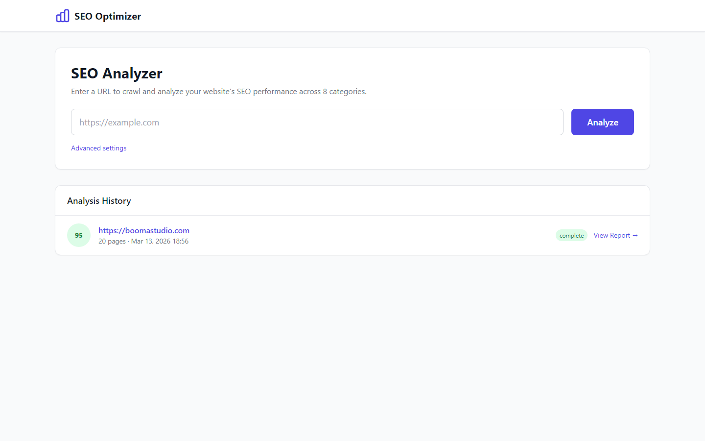
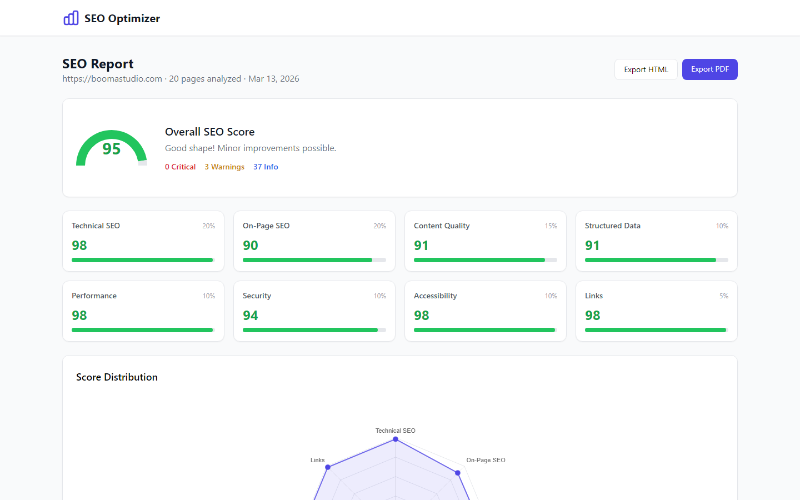
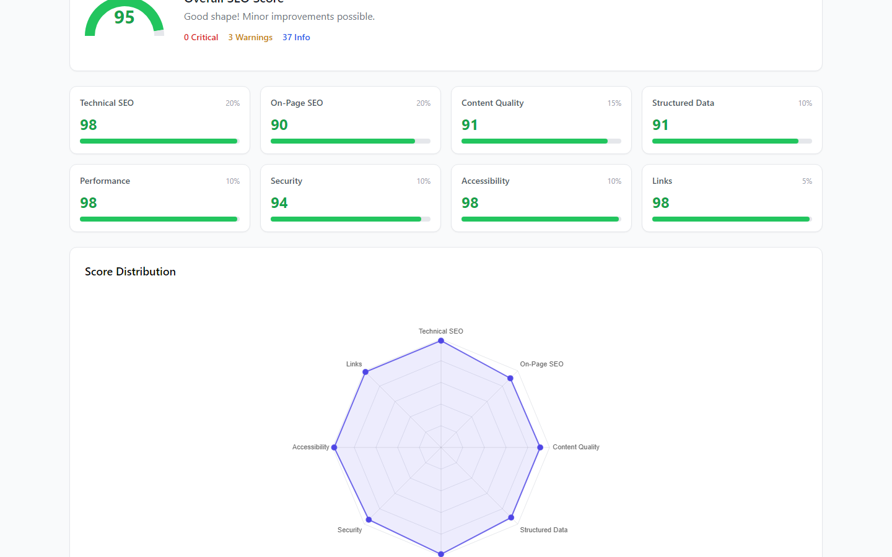
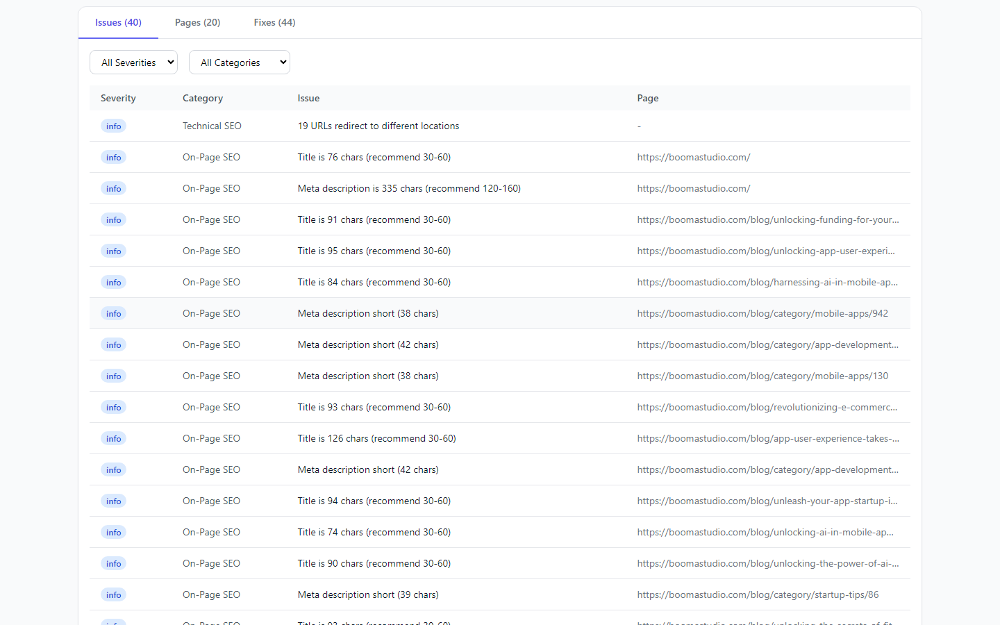
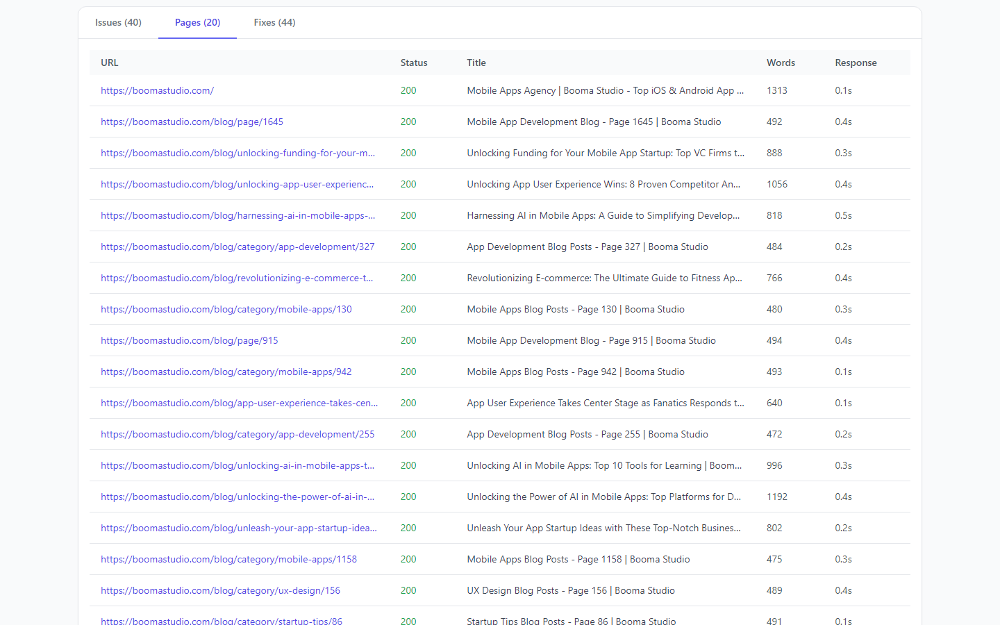
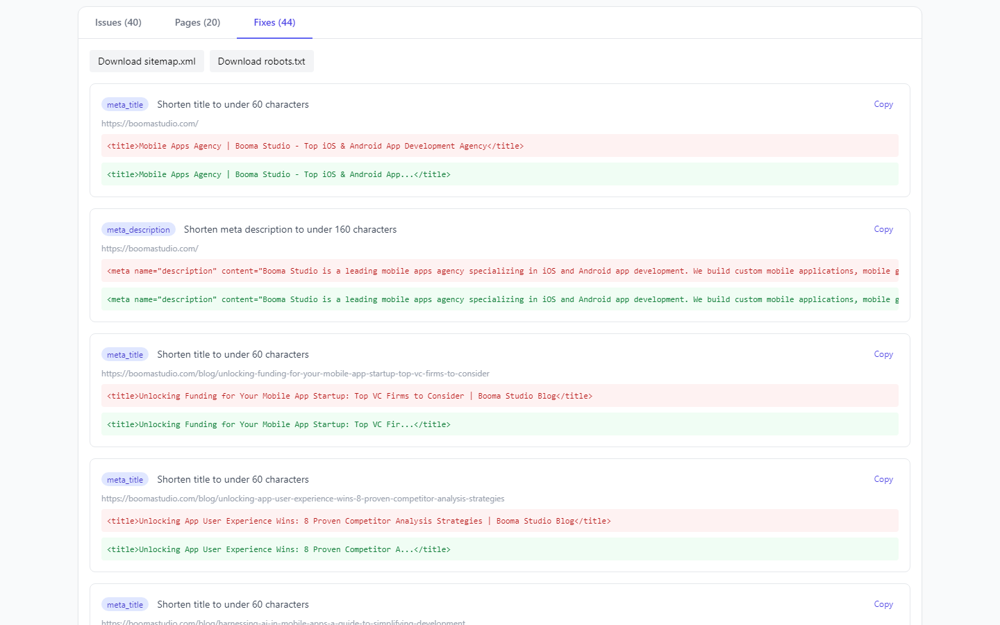

<p align="center">
  
</p>

<h1 align="center">SEO Optimiser</h1>

<p align="center">
  A comprehensive, self-contained SEO analysis tool with a web dashboard.<br>
  Crawl any website, analyze 8 SEO categories, get a 0-100 score, and receive ready-to-use fixes.
</p>

<p align="center">
  
  
  
  
</p>

---

## What It Does

Enter a URL, and SEO Optimiser will:

1. **Crawl** the entire site (async, respects robots.txt, configurable depth/pages)
2. **Analyze** every page across 8 SEO categories with 70+ rules
3. **Score** each category 0-100 and compute a weighted overall score
4. **Generate fixes** — copy-paste-ready meta tags, JSON-LD, sitemap.xml, robots.txt, and more
5. **Export** a full HTML or PDF report

No external API keys needed. Everything runs locally.

## Screenshots

### Dashboard
Enter a URL, configure crawl settings, and track progress in real-time via SSE.



### Report Overview
Overall score gauge, 8 category score cards, and a radar chart showing score distribution.



### Score Details
Radar chart breakdown and detailed category analysis.



### Issues
All detected issues filterable by severity (critical, warning, info) and category.



### Pages
Every crawled page with status code, title, word count, and response time.



### Fixes
Ready-to-use code snippets — meta tags, JSON-LD, sitemap, robots.txt — with one-click copy.



## Analysis Categories

| Category | Weight | What's Checked |
|----------|--------|----------------|
| **Technical SEO** | 20% | HTTPS, canonical tags, viewport, redirects, response time, status codes |
| **On-Page SEO** | 20% | Title tags, meta descriptions, H1, heading hierarchy, image alt text, duplicates |
| **Content Quality** | 15% | Readability (Flesch-Kincaid), thin content, text-to-HTML ratio, duplicate content |
| **Structured Data** | 10% | JSON-LD, Open Graph, Twitter Cards, Schema.org validation |
| **Performance** | 10% | Page size, resource count, render-blocking JS, image dimensions |
| **Security** | 10% | HTTPS, mixed content, HSTS, CSP, X-Frame-Options, X-Content-Type |
| **Accessibility** | 10% | Alt text, lang attribute, form labels, ARIA landmarks, semantic HTML |
| **Links** | 5% | Broken links, redirect chains, orphan pages, nofollow internal links |

## Auto-Generated Fixes

- Optimized `<title>` and `<meta description>` tags
- JSON-LD structured data (WebPage, Organization, BreadcrumbList)
- Complete `sitemap.xml` from crawled pages
- Corrected `robots.txt` with sitemap reference
- Heading hierarchy corrections
- Image alt text suggestions

## Quick Start

```bash
# Clone the repo
git clone https://github.com/yourusername/seo-optimiser.git
cd seo-optimiser

# Install dependencies
pip install -r requirements.txt

# Run
python run.py
```

Open **http://localhost:8080** in your browser.

## Requirements

- Python 3.11+
- No external API keys
- No Node.js or build tools (frontend uses CDN)

## Project Structure

```
seo-optimiser/
├── run.py                    # Entry point
├── requirements.txt
├── app/
│   ├── main.py               # FastAPI app
│   ├── config.py              # Settings
│   ├── database.py            # SQLite async setup
│   ├── models.py              # ORM models
│   ├── schemas.py             # Pydantic schemas
│   ├── api/                   # REST API endpoints
│   ├── crawler/               # Async crawl engine
│   ├── analyzers/             # 8 analysis modules
│   ├── scoring/               # Weighted scoring engine
│   ├── fixers/                # Auto-fix generators
│   └── export/                # HTML/PDF report export
├── templates/                 # Jinja2 HTML templates
└── static/                    # CSS + JS (Alpine.js, Chart.js via CDN)
```

## Tech Stack

| Layer | Technology |
|-------|-----------|
| Backend | FastAPI + Uvicorn |
| Database | SQLite via aiosqlite + SQLAlchemy async |
| Crawler | aiohttp + BeautifulSoup + lxml |
| Frontend | Jinja2 + Alpine.js + Tailwind CSS (CDN) |
| Live Updates | Server-Sent Events (SSE) |
| Charts | Chart.js (radar + gauge) |
| Readability | textstat (Flesch-Kincaid) |

## Configuration

Edit `app/config.py` or set environment variables:

| Setting | Default | Description |
|---------|---------|-------------|
| `MAX_CONCURRENT_REQUESTS` | 5 | Parallel crawl workers |
| `POLITENESS_DELAY` | 1.0s | Delay between requests |
| `MAX_PAGES` | 100 | Max pages per crawl |
| `MAX_DEPTH` | 5 | Max crawl depth |
| `REQUEST_TIMEOUT` | 30s | Per-request timeout |

## Taking Demo Screenshots

```bash
# Install playwright (one-time)
pip install playwright
python -m playwright install chromium

# Take screenshots (starts server, crawls a site, captures pages)
python take_screenshots.py https://example.com
```

Screenshots are saved to `screenshots/`.

## License

MIT
